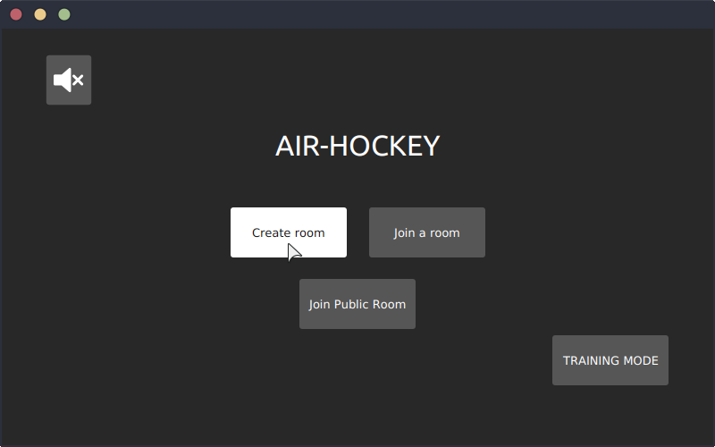
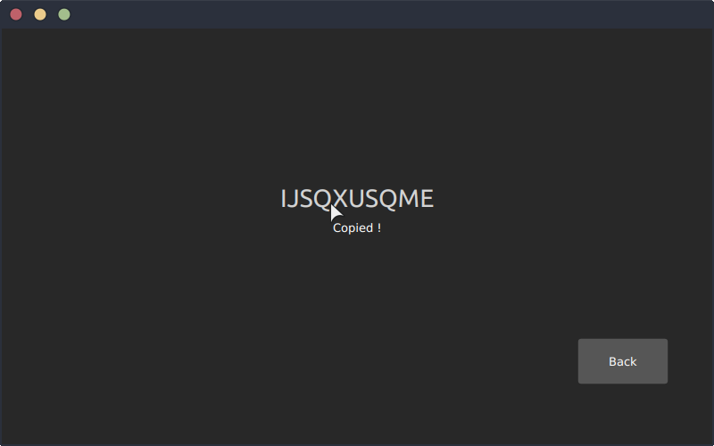
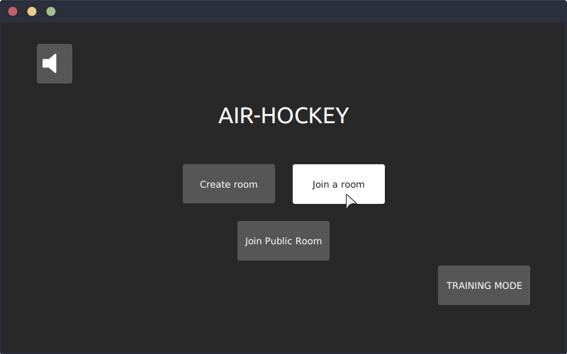
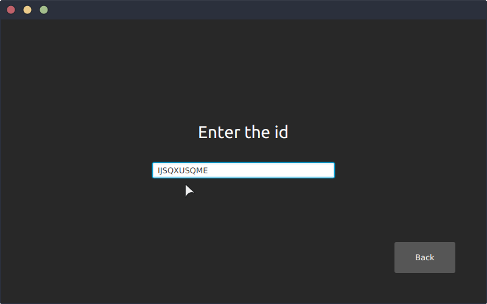
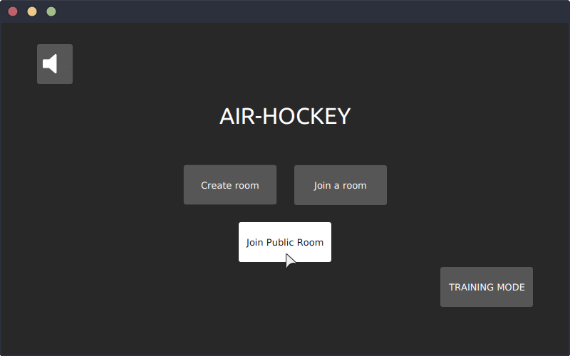
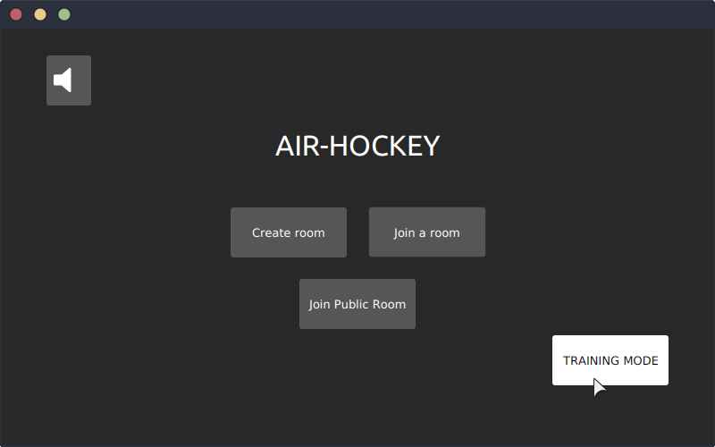

# AIR HOCKEY

## Presentation

Inspired by the real air hockey game, our game is a multiplayer air hockey.

Featuring a realistic physics engine managing not only collisions, speed and acceleration but also rotation effects on the puck with angular speed that allows you to spin the puck and use effects to beat your opponent.

You can play with your friends even if they are far or play with unknown players all around the world.

There is also a training mode were you can discover the game and step-up against an AI that might give you some hard time.

And last but not the least you have a nice and tidy game design and interface with custom-made music, sounds and visuals.


## Usage

### Build

```
git clone https://gaufre.informatique.univ-paris-diderot.fr/rougeoll/air-hockey.git
cd air-hockey/Projet
./gradlew build
```
### Run

#### To test on the same machine

To run the server :
```
./gradlew runServer
```
To run the client :
```
./gradlew run
```
#### To test with different machines

##### LAN (connected to the same network)

Here the IPV4 is the **private IPV4** (the local one)

To run the server :
```
./gradlew runServer --args='IPv4'
```
To run the client on a different machine :

```
./gradlew run --args='IPv4'
``` 

##### Online (connected to different network)
To run the server :
```
./gradlew runServer --args='IPv4'
```
the IPv4 here is the **private IPv4** of the machine.

**However**, to play online you'll need to open a port 
on your internet device. (port 6666, UDP type)

To run the client on a different machine :
```
./gradlew run --args='Public IPv4'
``` 
Here the IPv4 is the **public IPv4** of the machine running the server.

### How to launch a game

#### Private Game :

You need to have a friend to play online in a private game.
You or your friend click on the button **create room**
This person can click on the **ID** to copy, and send it to the other




The other click on the button **join room**, receive the **ID** and copy it !




you can play with your friend !

#### Public Game :

To play against anyone, you just have to click on the button **join public room**



### Play offline :

To play alone, against the AI, you have to click on the button **Training Mode**



### In Game :

The goal is to send the puck into the opposing goal with your pusher.

The game ends when one of the players has 7 points


## Documentation

Link for a thorough documentation : 
>[Serveur / UDP Protocole](doc_server.md) 

>[Physics](doc_physics.md)

## Contribution

For more precise details, checks commits in gitlab.

* Alexandre LEYMARIE:
    * model: the **physics** of the game, the **board** and the **model**, and the **AI**
    * gui: the **particles**, the **camera** and the **shaking screen**
    * network: the **room** class

* Etienne NEDJAI:
    * model: the **physics of the game**, the **board** and the **model**, and the **architecture of the AI**
    * gui: the **sound** and harmonization of the **theme** on the different menus

* Jules CHERION:
    * model: the implementation of the **angle speed** in the physics
    * gui: the **main architecture of the menus**, the **link between the network and the GUI** and **main design** of the different menus
    * network: **prototype** of the **client**, better **coherence between client's model** and **server's model**

* Yoan ROUGEOLLE:
    * model: the **AI** and the upgrade of the physics with the **angle speed**
    * gui: the **view**, the **animation** of the **elements of the model**, the **closing** of the **threads**
    * network: the main **architecture of the network**, the **client**, the **server**, **public room**, the **management of the rooms**

This is just a summary of what each do on the project, but there were still mutual help between the members on differents parts of the project.