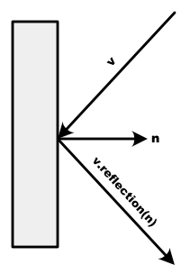
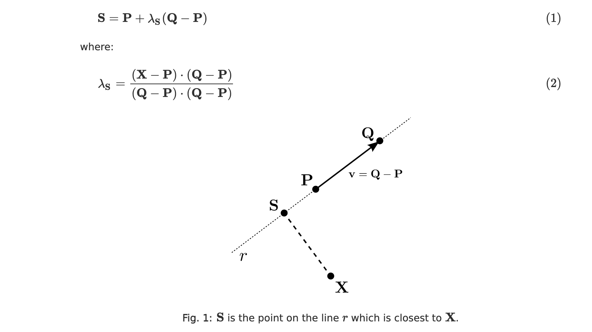
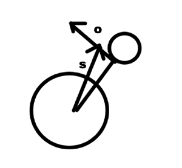

# DOCUMENTATION Physics

## Vector
The physics in this project are mostly based on the Vector class which is used to represent any vector or position in the game.

This class contains functions for basic vector operations such as addition, multiplication by a scalar, dot product...

##### Reflection
One notable function of the class Vector is the reflection function:
```
public Vector reflection(Vector n){
    //n multiplied by the dot product of this and n is the projection of this on the vector n (since ||n|| = 1)
    //so subtracting 2 times this vector to this means reversing the coordinate of this along the axis that goes in the direction of n, which is effectively a reflection
    return add(n.multiply(-2*dotProduct(n)));
}
```
Which calculates the reflection of the vector according to the normalized vector **n**:




## Wall - Circle collisions
To handle wall-circle collisions (for both the pushers and the puck), an useful function we implemented is the closestPoint function which calculates the closest point to a point p on a wall:
```
public Vector closestPoint(Vector p){
    //lambda is in [0, 1], lambda = 0 means that the closest point is on the start point of the wall, lambda = 1 means that the closest point is the end point of the wall
    double lambda = Math.max(0, Math.min(1, (p.add(position.multiply(-1)).dotProduct(direction))/(direction.dotProduct(direction))));
    //by multiplying D by lambda and adding it to P we get the actual position of the point
    return position.add(direction.multiply(lambda));
}
```

Where the formula below is used:

[Source of the image](https://diego.assencio.com/?index=ec3d5dfdfc0b6a0d147a656f0af332bd)

Knowing the closest point on the wall allows to easily detect and resolve wall-circle collisions: if the distance between the center of the circle and the closest point to this center on the wall is inferior to the radius of the circle, there is a collision, which can be resolved easily by moving the circle in the direction of the vector center - wall.closestPoint(center).

## Puck movement
At each frame, the puck moves along its speed vector proportionally to the time elapsed since the last frame.
Actually, it doesn't move directly to this end position: it moves step by step (each step is half the size of its radius) in direction of the end position and checks at each step for collisions.
If a collision is detected with a wall (with the function closestPoint), it uses the function reflection of its speed vector with the normal vector of the wall to get its new speed.

#### Angular speed
On top of this straight movement, we decided to allow the puck to spin on itself, which curves its direction when the angular
speed is high, and changes the direction of the speed when bouncing on walls.

The gain of angular speed is calculated when a collision with a pusher occurs:
```
Vector normal = position.sub(p.position).normalize();
Vector orthogonal = normal.getOrthogonal();
double angleSpeed = orthogonal.dotProduct(p.getSpeed().sub(speed))*(-0.1);
setAngleSpeed(getAngleSpeed()+angleSpeed);
```


The angular speed added is proportional to the dot product of **s** and **o**, where **s** is the relative speed between the pusher and the puck, and **o** is the orthogonal vector of the direction from the pusher to the puck. This formula has the consequence of: if the pusher shoots straight at the puck, the dot product will be 0 and the angular speed won't change, and if the pusher shoots in the direction of **o**, the dot product will be 1 and the angular speed change will be maximal.

Then, the angular speed decreases with frictions, and is converted into speed to modify the movement of the puck:
##### Curve
For the curve, we first apply friction to the angular speed and calculate the quantity of energy lost using the formula of rotational energy:
```
double oldEnergy = angleSpeed * angleSpeed * getRadius() * getRadius();
angleSpeed *= Math.pow(0.85, Math.sqrt(dt));
double diffEnergy = oldEnergy - angleSpeed * angleSpeed * getRadius() * getRadius();
```

Then, we add to the speed a vector orthogonal to the speed vector with a length determined by the amount of energy lost with the friction, which we convert into speed with the formula of kinetic energy:
```
speed = speed.add(dir.getOrthogonal().multiply(Math.sqrt(COEFF_CURVE*diffEnergy)*2*dt));
```
(where dir is the direction of the speed vector, and *COEFF_CURVE* is a constant we used to balance the change of speed)

##### Wall collision

For the change of direction when a collision with a wall occurs, we apply the same energy conversion mechanism, but instead of adding speed in the direction of the orthogonal of the speed, we add a vector orthogonal to the direction towards the closest point on the wall:
```
double oldEnergy = angleSpeed * angleSpeed * getRadius() * getRadius();
angleSpeed *= 0.5;
double diffEnergy = oldEnergy - angleSpeed * angleSpeed * getRadius() * getRadius();
Vector wallDir = w.closestPoint(getPosition()).sub(getPosition()).normalize().getOrthogonal();
speed = speed.add(wallDir.multiply(-Math.sqrt(2*diffEnergy)*.5));
```


go back to [README](README.md)