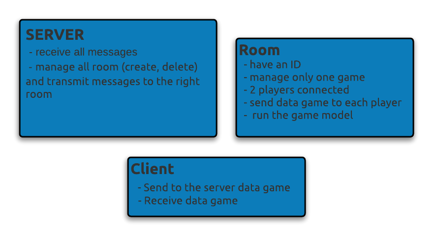
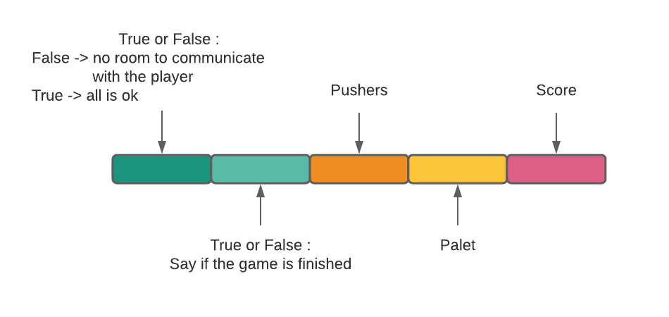

# DOCUMENTATION Server/UDP Protocole

## 3 Classes

## Messages(Client ----> Server)

## During Game

### Message (Client ----> Server ----> Room)

### Message (Room ----> Client)

go back to [README](README.md)